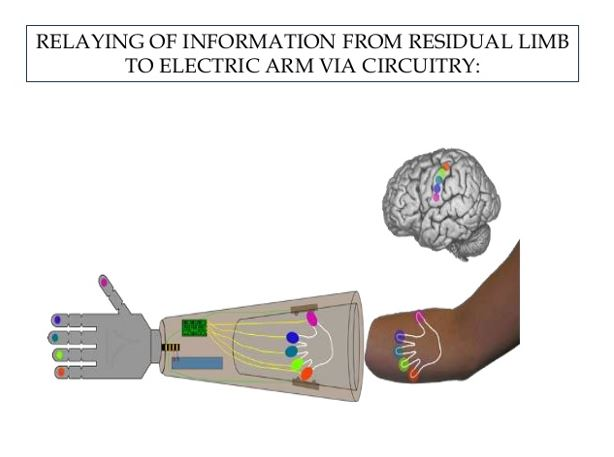
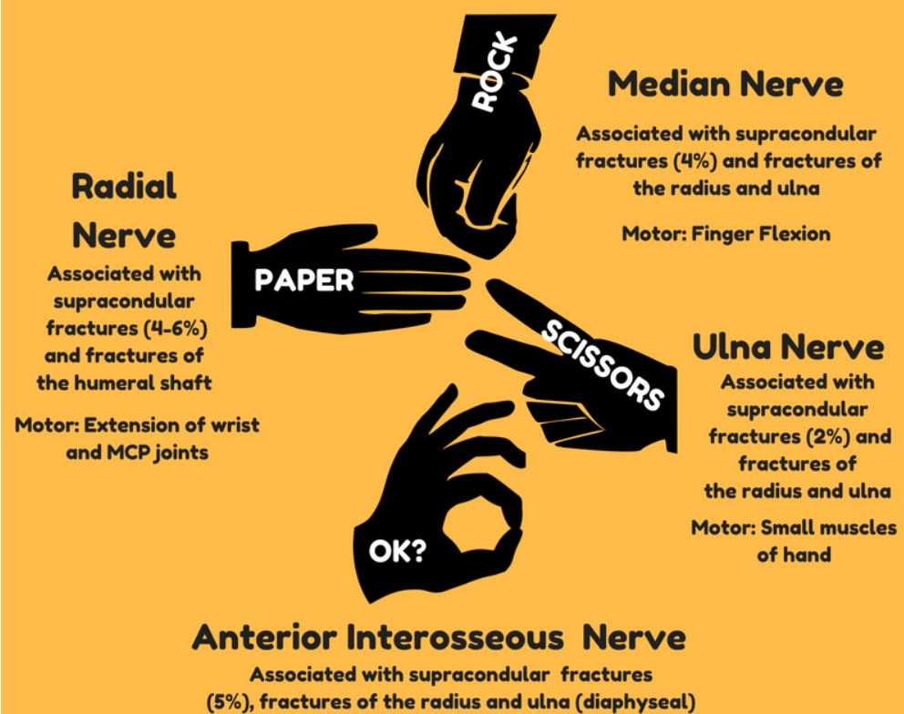
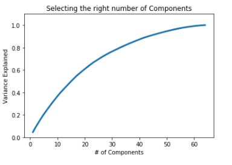
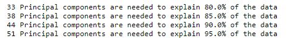
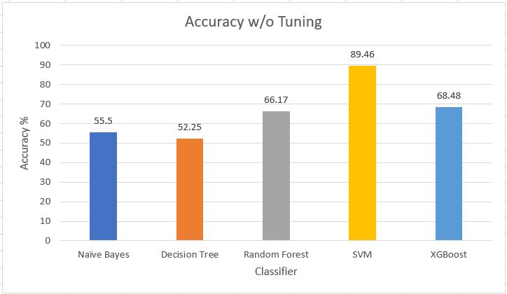
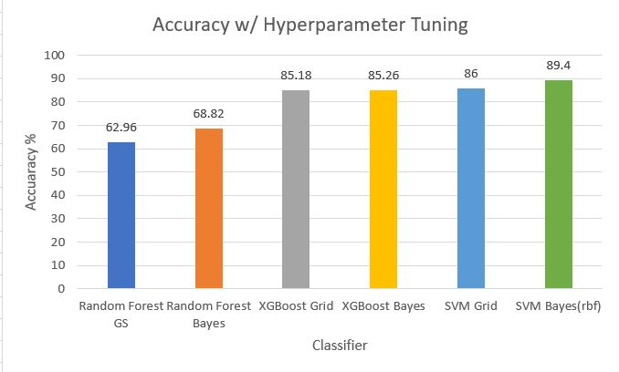

# Classifying Hand Gestures of Myoelectric Armband

## Introduction

Prosthetic limbs have helped numerous people resume their normal lives even after an accident. Prosthetics, such as an arm, can usually be controlled by cables linking elsewhere in the body (e.g. one arm can be used to control the other). However, this can be cumbersome and redundant. However, myoelectric prosthetics are more advanced because they can read the electric signals of existing, contracting muscles, which can then be used to control the prosthetic. 

Because individual users may have varying electric signals, it is crucial to collect user-specific data and create an effective model that can correctly interpret the intentions of the user. The following dataset on kaggle has been collected by Kirill Yashuk and shows readings from 8 sensors from a Myo armband designed to pick up electrical signals of muscle contractions. Each reading corresponds to one of four different hand postures:

This investigation will utilize a variety of supervised learning models to correctly classify each reading. A conclusion will be presented at the end to summarize results.

## Table of Contents

- 0.csv - Readings for *rock* hand gesture

- 1.csv - Readings for *paper* hand gesture

- 2.csv - Readings for *scissors* hand gesture

- 3.csv - Readings for *ok* hand gesture

- student.ipynb - Python notebook for project

## Project Steps

1. Combination of csv files

2. Scaling with StandardScaler

3. PCA Analysis to reduce components from 64 to 44 features to ensure 90% variance is kept

4. Models built with five different machine learning algorithms

## Project Results

1. Five models with default parameters created with Pipeline and evaluated on accuracy
  
  
  
2. Random Forest, SVM, and XGBoost in conjunction with Bayes Optimization and Grid Search for hyperparameter optimization
  
  
        

Overall, Suppert Vector Machine performed the best both with and without hyperparameter tuning. However, it is also notable that XGBoost improved considerably
with hyperparameter tuning. Lastly, Bayes Optimization surpassed GridSearch CV in for all classifiers, even if only marginally so. 

## Future Considerations

1. Attempt other hyperparameter tuning techniques
2. Purchase an armband to test for more readings/gestures
3. Create models using neural networks
